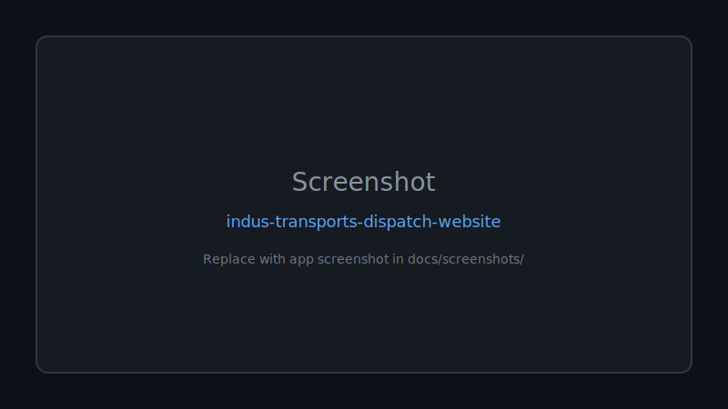

# 🚀 Indus Transports Dispatch Website

**Professional truck dispatch and freight logistics website built with HTML, Bootstrap, JavaScript, SEO optimization, onboarding forms, earnings calculator, and responsive multi-page design.**

Documented · MIT licensed · Maintained

[Features](#-features) · [Quick Start](#-quick-start) · [Screenshots](#-screenshots) · [Contributing](CONTRIBUTING.md)

---

## 🖼 Screenshots

*Replace `docs/screenshots/placeholder.svg` with real app screenshots.*

---

## 🐍 Contribution graph

<picture>
  <source media="(prefers-color-scheme: dark)" srcset="https://raw.githubusercontent.com/mafzalkalwardev/indus-transports-dispatch-website/output/snake-dark.svg" />
  <source media="(prefers-color-scheme: light)" srcset="https://raw.githubusercontent.com/mafzalkalwardev/indus-transports-dispatch-website/output/snake.svg" />
  
</picture>

---

INDUS TRANSPORTS LLC is a professional truck dispatch and freight logistics website designed for owner-operators and trucking companies across the USA.

The platform provides dispatch services, load booking support, earnings estimation, equipment-specific freight solutions, and carrier onboarding. It includes a responsive multi-page design with SEO optimization, interactive forms, an earnings calculator, and professional logistics branding.

## Features

- Responsive trucking company website
- Truck dispatch service pages
- Equipment type showcase
- Earnings calculator
- Carrier onboarding system
- Contact and inquiry forms
- SEO optimized pages
- Mobile-friendly UI
- Bootstrap-based design

## Technologies Used

- HTML5
- CSS3
- Bootstrap 5
- JavaScript
- FormSubmit / Formspree Integration

## Author

Muhammad Afzal Kalwar  
GitHub: @mafzalkalwardev
